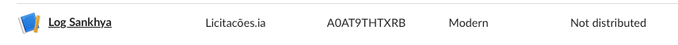
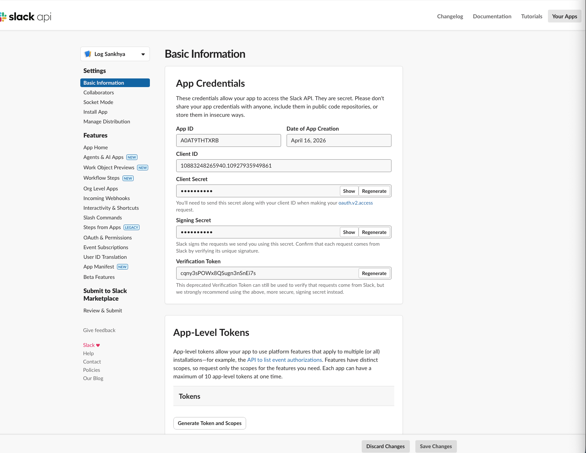
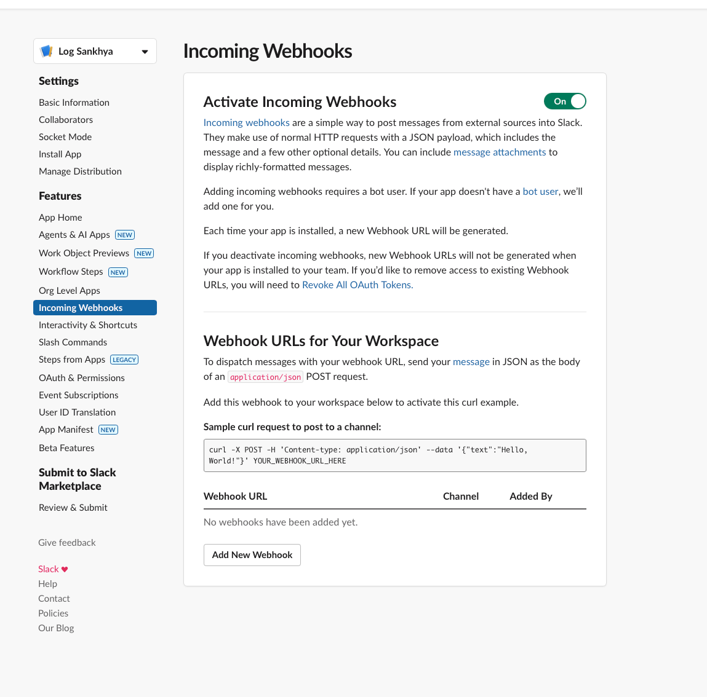

# INSTALACAO

Guia passo-a-passo pra quem nunca usou Slack. Leva ~10 minutos.

> Nos exemplos usamos `Log Sankhya` (app) e `#logsankhya` (canal), mas voce
> pode escolher qualquer nome. A skill nao depende desses nomes em lugar
> nenhum — e tudo configuravel.

## Parte 1 — Workspace

### 1. Criar workspace Slack (se ainda nao tem)

Acesse [slack.com/create](https://slack.com/create) e crie um workspace com o
e-mail da sua empresa. Nao precisa convidar ninguem agora.

## Parte 2 — App Slack (cria o bot)

### 2. Criar app Slack

Acesse [api.slack.com/apps](https://api.slack.com/apps), clique em
**Create New App → From scratch**. Escolha:

- **Nome do app:** o que preferir (ex: `Log Sankhya`, `Meu Logger`).
- **Workspace:** o criado no passo 1.

Esse nome vai aparecer como autor das mensagens no canal.
O bot e criado automaticamente com o mesmo nome.

Se voce ja tem o app criado, ele aparece na lista:



Clique no nome pra abrir a pagina Basic Information:



### 3. Ativar Incoming Webhooks

No menu lateral do app (seção Features), clique em **Incoming Webhooks**.
Ative o toggle **Activate Incoming Webhooks** (deve ficar verde "On").



Ainda NAO crie o webhook — o canal ainda nao existe.

## Parte 3 — Canal

### 4. Criar o canal de logs

Volte pro app Slack. Clique em **Adicionar canal → Criar canal**. Escolha:

- **Nome:** o que preferir (ex: `logsankhya`).
- **Privacidade:**
  - **Privado** (recomendado — logs podem ter dado sensivel).
  - **Publico** (qualquer pessoa do workspace ve).

### 5. Se PRIVADO: adicionar o bot ao canal

Canal privado nao permite que o webhook poste nele sem que o bot seja
membro. Na caixa de mensagem do canal, envie:

```
/invite @<nome-do-seu-bot>
```

O Slack autocompleta com o nome do app criado no passo 2. Apos o convite,
aparece a mensagem "X adicionou Y ao canal".

> Canal publico nao precisa deste passo.

## Parte 4 — Webhook

### 6. Criar webhook apontando pro canal

Volte em [api.slack.com/apps](https://api.slack.com/apps) → seu app →
**Incoming Webhooks**. Role pra baixo e clique em
**Add New Webhook to Workspace**. Escolha o canal criado no passo 4.
Clique em **Allow**.

### 7. Copiar Webhook URL

O Slack mostra a URL. Clique em **Copy**. Formato:
`https://hooks.slack.com/services/T.../B.../...`. Essa URL e **secreta** —
trate como senha.

### 8. Salvar localmente (sem colar em chat)

No terminal, cole (com a URL ainda no clipboard):

```bash
pbpaste > ~/.sankhya-slack-webhook && chmod 600 ~/.sankhya-slack-webhook
```

Confirme: `head -c 30 ~/.sankhya-slack-webhook` — tem que comecar com
`https://hooks.slack.com/services/T`.

### 9. Testar que o bot posta no canal

```bash
curl -sS -X POST -H 'Content-Type: application/json' \
  -d '{"text":"Teste inicial — snk-slack config nova :wave:"}' \
  "$(cat ~/.sankhya-slack-webhook)"
```

Saida esperada: `ok`. Abra o Slack no canal e confirme que a mensagem
apareceu.

Se deu erro:

- `channel_not_found` → bot nao e membro do canal privado. Volte ao passo 5.
- `invalid_payload` → URL do webhook errada. Refaca passos 6-8.

## Parte 5 — Lib no projeto Sankhya

### 10. Instalar a lib

Dentro do projeto Sankhya Java, peca ao Claude:

> "Adiciona o log Slack nesse projeto."

A skill Claude Code copia os 5 arquivos Java da lib para
`src/br/com/lbi/slack/`, valida o Gson no classpath e instrumenta o entry
point principal.

Se preferir fazer manualmente: copie os 5 arquivos de `src/br/com/lbi/slack/`
desse repo para o seu projeto. Confira que o Gson esta no `.classpath`.

### 11. Criar preferencia LOGSLACK_WEBHOOK no Sankhya W

Em **Administracao → Preferencias**, crie:

- **Nome:** `LOGSLACK_WEBHOOK`
- **Tipo:** TEXTO
- **Tamanho:** 500
- **Descricao:** `URL do Incoming Webhook Slack para logs (veja snk-slack)`
- **Valor:** cole a URL copiada no passo 7

Ver instrucoes detalhadas de UI em
[scripts/criar-preferencia-logslack.md](scripts/criar-preferencia-logslack.md).

### 12. Testar ponta-a-ponta

Acione o botao/rotina instrumentada no Sankhya. Em segundos uma mensagem
aparece no canal configurado com o header do modulo e as entradas de log.

## Personalizacao opcional

Por padrao, a lib nao sobrescreve o nome configurado no app Slack — cada
cliente aparece com o proprio nome. Se quiser forcar um nome:

```java
SlackLogger slack = SlackLogger.create(null)
    .modulo("Meu Modulo")
    .header("Minha Acao")
    .username("Sankhya Bot")   // sobrescreve nome do app
    .icon(":warning:")          // sobrescreve icone
    .build();
```

## Troubleshooting rapido

- **Nao aparece nada no Slack:** `LOGSLACK_WEBHOOK` existe? Valor nao vazio?
- **HTTP 404 channel_not_found:** canal privado e bot nao foi convidado.
- **HTTP 404 outro:** URL errada ou revogada.
- **Log truncado:** falta `flush()` no caminho de erro. Ver BOAS_PRATICAS.
- **Quer mudar de canal:** altere so a preferencia — sem redeploy.
